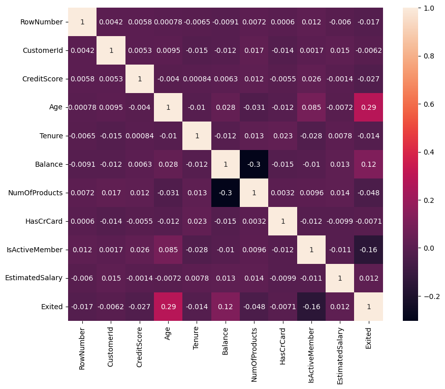
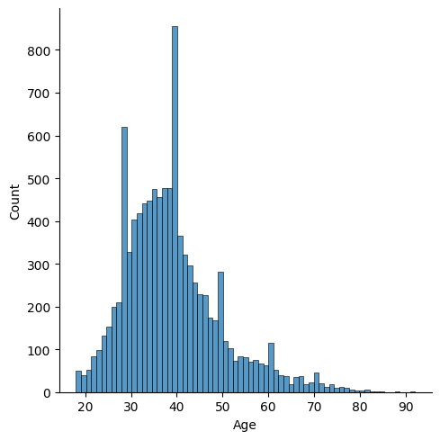

# Laporan Proyek UAS Machine Learning
### Nama : Satria Ishanda Subakti
### Nim : 211351135
### Kelas : Pagi B

## Domain Proyek
Churn for bank customer ini tentang kesetiaan seorang nasabah dari suatu bank berdasarkan nilai skor kredit, jangka waktu nasabah berlangganan di bank tersebut, nilai saldo dan sebagainya. berdasarkan atribut yang ada kita dapat melihat apakah nasabah itu tetap memilih bank tersebut atau justru meninggalkan bank tersebut
## Business Understanding
Dengan adanya Churn for bank customer ini membuat kita mengetahui faktor apa saja yang mempengaruhi seorang nasabah memilih atau meninggalkan bank tersebut dan kita dapat mengetahui faktor kunci mengapa nasabah tersebut meninggalkan bank
bagian laporan ini mencakup
### Problem Statements
Ketidaktahuan kita mengenai kesetiaan, meninggalkan atau bertahannya seorang nasabah di suatu bank
### Goals
agar kita dapat mengetahui apakah nasabah memilih bertahan dengan bank tersebut atau meninggalkan bank tersebut berdasarkan data yang ada dari kaggle
### Solution Statement
- website ini berisi tentang apakah seseorang itu setia dengan bank yang dia pilih atau meninggalkan bank tersebut berdasarkan sejumlah faktor atau atribut yang tersedia. datset ini terintegrasi dengan kaggle agar dapat dikatakan bahwa data tersebut valid
- Untuk Modeling Churn for bank customer ini menggunakan metode Decision Tree
## Data Understanding
Dataset yang saya gunakan diambil dari Kaggle dengan tema churn for bank customer. dataset ini berisi tentang skor kredit, lamanya nasabah berlangganan dengan bank tersebut, uang saldo produk apa yang dibeli menggunakan bank tersebut dan sebagainya. untuk dataset sumbernya bisa cek link ini </br>
[Churn for Bank Customer](https://www.kaggle.com/datasets/mathchi/churn-for-bank-customers)
## Variabel-variabel yang digunakan
- RowNumber : berhubungan dengan catatan(baris), kolom ini tidak berperngaruh kepada output (Bertipe data Int)
- CustomerId : berisi nilai acak, Kolom ini tidak berpengaruh kepada output (Bertipe data Int)
- Surname : nama belakang dari nasabah, tidak berpengaruh kepada keputusan mereka untuk meninggalkan atau beralih bank tersebut (Betipe data object)
- CreditScore : dapat berdampak kepada kesetiaan nasabah, karena nasabah dengan skor kredit yang tinggi, kecil kemungkinan nasabah untuk meninggalkan bank tersebut (Bertipe data Int)
- Geography : lokasi nasabah, dapat mempengaruhi keputusan mereka untuk meninggalkan bank(Bertipe data object)
- Gender : gender dari nasabah, menarik untuk dieksplor apakah gender berpengaruh apakah seseorang itu meninggalkan bank atau tidak(Bertipe data object)
- Age : Usia nasabah, ini relevan karena nasabah yang lebih tua cenderung tidak akan meninggalkan bank mereka dibandingkan nasabah yang lebih muda (Bertipe data Int)
- Tenure : Jangka waktu, merujuk pada jumlah tahun seseorang itu menjadi nasabah bank. biasanya nasabah yang sudah lama itu lebih loyal dan kecil kemungkinannya untuk meninggalkan bank (Bertipe data Int)
- Balance : Saldo, merupakan indikator yang sangat baik untuk mengetahui kesetiaan nasabah, karena orang yang memiliki saldo yang lebih tinggi di rekeningnya cenderung tidak akan meninggalkan dibandingkan mereka yang memiliki saldo yang rendah (Bertipe data Float)
- NumOfProducts : merujuk pada jumlah produk yang telah dibeli oleh nasabah melalui bank tersebut (Bertipe data Int)
- HasCrCard : menunjukkan apakah nasabah memiliki kartu kredit atau tidak, kolom ini juga relevan karena nasabah yang memiliki kartu kredit cenderung tidak akan meninggalkan bank (Bertipe data Int)
- IsActiveMember : nasabah yang aktif cenderung tidak akan meninggalkan bank(Bertipe data Int)
- EstimatedSalary : seperti halnya saldo, orang dengan gaji yang lebih rendah cenderung meninggalkan bank dibandingkan dengan orang yang gajinya tinggi(Bertipe data Float)
- Exited : apakah nasabah meninggalkan bank atau tidak (Bertipe data Int)
## Data Preparation

### Data Discovery and Profiling
Hal pertama yang dilakukan yaitu membuka text editor, disini saya memakai Google Colab lalu membuat file baru dengan format ipynb. karena kita menggunakan text editor google colab maka untuk pengerjaaannya dimulai dari import file dan melakukan file upload dengan mengambil token API kita dari kaggle yang nanti akan terdownload dengan kaggle.json
``` python
from google.colab import files
files.upload()
```
lalu ketika di running akan ada tombol untuk choose file, nah yang kita upload adalah file kaggle.json, tahap berikutnya adalah membuat direktori dan memberikan permission dengan cara 
``` python
!mkdir -p ~/.kaggle
!cp kaggle.json ~/.kaggle/
!chmod 600 ~/.kaggle/kaggle.json
!ls ~/.kaggle
```
selanjutnya kita panggil url dataset dari website kaggle untuk langsung didownload
``` python
!kaggle datasets download -d mathchi/churn-for-bank-customers
```
selanjutnya kita ekstrak dataset yang sudah kita download dengan cara
``` python
!mkdir churn-for-bank-customers
!unzip churn-for-bank-customers.zip -d churn-for-bank-customers
!ls churn-for-bank-customers
```
selanjutnya saya mengimport library yang dibutuhkan untuk pembahasan ini
``` python
import numpy as np
import pandas as pd
import matplotlib.pyplot as plt
import seaborn as sns
```
dan jangan lupa untuk pemanggilan library scikit learn, scikit learn ini berguna untuk memanggil atau mengakses berbagai algoritma yang akan kita pakai. karena disini menggunakan metode Decision Tree, kita panggil library scikit learn khusus Decision tree, untuk transformasi data dan melihat akurasi skor, confusion matrix dan laporan klasifikasi dengan cara
``` python
from sklearn.preprocessing import LabelEncoder
from sklearn.model_selection import train_test_split
from sklearn.metrics import accuracy_score, confusion_matrix, classification_report
from sklearn.tree import DecisionTreeClassifier
from sklearn import tree
from sklearn import metrics
```
untuk pemanggilan dataset yang sudah kita ekstrak sebelumnya dan dataset ini akan dipakai untuk pengerjaan kali ini kita dapat memanggilnya dengan cara 
``` python
df = pd.read_csv('churn-for-bank-customers/churn.csv')
```
untuk melihat isi dari dataset dari 5 buah record awal, kita bisa memanggilnya dengan cara
``` python
df.head()
```
untuk melihat tipe data dari semua kolom di dataset tersebut kita bisa memanggilnya dengan cara
``` python
df.info()
```
untuk melihat semua nilai rata-rata maupun nilai dari kuartil 1 sampai kuartil 3 kita bisa memanggilnya dengan cara
``` python
df.describe()
```
untuk melihat apakah dataset ini terdapat nilai NaN atau tidak, kita dapat mengeceknya dengan cara
``` python
df.isnull().sum()
```
selanjutnya jika kita ingin melihat ada berapa record data dan jumlah kolom yang tersedia pada dataset ini kita dapat mengeceknya dengan cara
``` python
df.shape
```
didapatkan bahwa jumlah record data pada dataset ini berjumlah 10000 record dan jumlah kolom atau atribut yang tersedia berjumlah 14

untuk melihat jumlah salah satu kolom yaitu Exited agar dapat mengetahui jumlah yang bertahan atau yang meninggalkan bank dapat diliat dengan cara
```python
df['Exited'].value_counts()
```
hasilnya dapat diketahui bahwa nasabah yang masih bertahan pada bank berjumlah 7963 nasabah, sedangkan nasabah yang meninggalkan bank berjumlah 2037 nasabah

Next kita mengecek jumlah nasabah berdasarkan gender, dengan cara
```python
df['Gender'].value_counts()
```
hasilnya dapat diketahui bahwa nasabah dengan gender laki-laki sebanyak 5457 Nasabah sedangkan gender perempuan sebanyak 4543 Nasabah

## Exploratory Data Analysis
untuk melihat apakah terdapat nilai yang kosong atau NaN pada dataset ini kita panggil dengan cara
``` python
sns.heatmap(df.isnull())
```


Dapat dilihat bahwa data tersebut tidak ada yang kosong dan data ini dapat dipakai untuk analisa lebih lanjut

Selanjutnya kita akan melihat sebaran data pada dataset ini, kita dapat memanggilnya dengan cara
``` python
plt.figure(figsize=(10,8))
sns.heatmap(df.corr(), annot=True)
```



kita dapat melihat bahwa hanya hubungan Age dengan Exited yang berwarna cerah dibandingkan dengan yang lainnya maka dari ini kita dapat menyimpulkan bahwa usia memiliki pengaruh yang cukup besar terhadap keputusan nasabah untuk bertahan ataupun meninggalkan bank

Selanjutnya kita akan melihat darimanakah nasabah ini berasal berdasarkan dataset ini, kita akan memakai visualisasi countplot agar mengetahui jumlah nasabah di negara yang tertera, kita dapat memanggilnya dengan cara
``` python
sns.countplot(x=df['Geography'])
plt.title('Country')
plt.show()
```


dari data ini kita dapat melihat bahwa negara prancis merupakan negara dengan nasabah terbanyak pada dataset dengan jumlah 5000 nasabah diikuti negara spanyol dan jerman dengan jumlah yang hampir sama

next kita akan melihat jumlah nasabah berdasarkan usia, disini saya akan memakai distplot, pemanggilannya dengan cara
``` python
sns.displot(df, x='Age')
```



dapat dilihat bahwa sebagian besar nasabah berusia 30-40 tahun 

selanjutnya kita akan melihat kemungkinan nasabah meninggalkan bank berdasarkan usia nasabah, disini saya akan memakai lineplot dengan cara
``` python
sns.lineplot(x=df['Age'], y=df['Exited']) 
```


kita dapat melihat dari grafik bahwa mulai diusia 25 tahun sampai 55 tahun chance untuk meninggalkan bank menaik. dan dari usia 25-55 tahun sebagian meinggalkan bank

selanjutnya kita akan melihat presentase nasabah dari dataset ini berdasarkan gender, disini saya memakai pieChart, pemanggilannya dengan cara
```python
plt.title('Percentage Male And Female in Dataset')
plt.pie(df['Gender'].value_counts(), labels=['Male', 'Female'], autopct='%.2f%%')
plt.show()
```


dapat dilihat bahwa laki-laki memiliki presentase lebih tinggi daripada perempuan meski perbedaannya tidak begitu jauh

selanjutnya kita akan melihat nilai tertinnggi dari skor kredit, usia, saldo dan estimated salary, pemanggilannya dengan cara
``` python
number_list = ['CreditScore', 'Age', 'Balance', 'EstimatedSalary']
df[number_list].hist(figsize=(10,8))
```


dilihat dari grafik ini untuk skor kredit yang dimiliki nasabah sebagian besar memiliki skor 650-700, selanjutnya kebanyakan nasabah berusia 35-40 tahun untuk saldo sebagian besar nasabah memiliki kisaran 0-25000 dan untuk estimated salary kebanyakan nasabah memiliki 50000 sampai 150000

next untuk melihat orang yang exited atau melihat beralih atau tidaknya dari nasabah berdasarkan saldo, kita dapat melihatnya dengan cara
```python
(sns.FacetGrid(df, hue='Exited', height = 4).map(sns.kdeplot,"Balance", fill=True).add_legend())
```


kita dapat melihat bahwa yang memiliki saldo yang sedikit itu ternyata memilih bertahan memilih bank tersebut dan yang memiliki saldo yang tinggi belum tentu si nasabah itu bertahan di bank tersebut

selanjutnya kita akan melihat berapa banyak nasabah yang meninggalkan bank atau yang bertahan berdasarkan negara si nasabah tersebut, kita dapat memanggilnya dengan cara
``` python
plt.figure(figsize=(10,6))
sns.countplot(x=df['Exited'], hue='Geography', data=df)
plt.show()
```


kita dapat melihat bahwa kebanyakan nasabah yang bertahan dibank tersebut berasal dari negara prancis dan yang terendah berada di negara jerman
dan nasabah yang meninggalkan bank yang terbanyak dari negara prancis dan jerman dengan jumlah yang serupa
## Preprosessing
kita akan melihat lagi data dari dataset ini dengan cara
```python
df.head()
```
sudah didefinisikan sebelumnya di Data Understanding bagian variabel yang digunakan, terdapat 3 variabel atau kolom yang tidak mempengaruhi kepada variabel yang ditesting maupun tidak mempengaruhi hasil output yaitu RowNumber, CustomerId dan Surname, kita akan menghapus kolom tersebut dengan cara
```python
df = df.drop(['RowNumber', 'CustomerId', 'Surname'], axis=1)
```
dan kita dapat mengeceknya kembali dengan cara
```python
df.head()
```
```python
df.columns
```
```python
df.info()
```
kita dapat melihat bahwa kolom tersebut sudah terhapus dan hanya tersisa total 11 kolom 

selanjutnya kita akan memisah mana atribut yang bersifat kategori dan mana yang bersifat numerik, kita dapat memanggilnya dengan cara
```python
numerical = []
categorycols = []

for col in df.columns:
  if df[col].dtype=="object":
    categorycols.append(col)
  else:
    numerical.append(col)

for col in df.columns:
  if col in numerical:
    df[col].fillna(df[col].median(), inplace=True)
  else:
    df[col].fillna(df[col].mode()[0], inplace=True)
```
kita coba panggil dengan cara
```python
numerical
```
untuk numerical terdiri dari 'CreditScore',
 'Age',
 'Tenure',
 'Balance',
 'NumOfProducts',
 'HasCrCard',
 'IsActiveMember',
 'EstimatedSalary',
 'Exited'
```python
categorycols
```
untuk categorycols terdiri dari 'Geography' dan 'Gender'
selanjutnya kita akan menentukan mana variabel bebas dan variabel terikatnya, kita akan masukkan ke variable ind_col dan dep_col dengan cara
``` python
ind_col = [col for col in df.columns if col != 'Exited']
dep_col = 'Exited'
```
untuk mengetahui jumlah dep_col pada dataset ini kita dapat melihatnya dengan cara
```python
df[dep_col].value_counts()
```
karena dep_col itu data dari kolom Exited maka jumlahnya sama seperti jumlah dari kolom Exited Yaitu nasabah yang masih bertahan pada bank berjumlah 7963 nasabah, sedangkan nasabah yang meninggalkan bank berjumlah 2037 nasabah

next disini saya akan mentransformasi dataset agar data dari dataset ini bertipe numeric semua agar dapat di modelling dengan cara
```python
le = LabelEncoder()

for col in categorycols:
  df[col] = le.fit_transform(df[col])
```
dan juga 
```python
df['Exited'] = le.fit_transform(df['Exited'])
```
kita dapat mengeceknya kembali dengan cara
```python
df.head()
```
untuk mempersiapkan data untuk dimodelling kita dapat mendefinisikannya mana yang akan menjadi fitur dan label dengan cara
```python
x = df[ind_col] #feature
y = df[dep_col] #label
x.shape, y.shape
```
## Modelling
sebelum melakukan modelling, kita perlu memisahkan data training dan data testing kita definisikan ukuran testingnya 20% dengan cara
``` python
x_train, x_test, y_train, y_test = train_test_split(x, y, test_size=0.20, random_state=0)
```
karena metode ini menggunakan decision tree kita perlu mendefinisikan rumus kodde programnya dengan cara
``` python
dtc = DecisionTreeClassifier(
    ccp_alpha=0.0, class_weight=None, criterion='entropy',
    max_depth=4, max_features=None, max_leaf_nodes=None,
    min_impurity_decrease=0.0, min_samples_leaf=1,
    min_samples_split=2, min_weight_fraction_leaf=0.0,
    random_state=42, splitter='best'
)

model = dtc.fit(x_train, y_train)

dtc_acc = accuracy_score(y_test, dtc.predict(x_test))

y_pred = model.predict(x_test)
```
selanjutnya kita lihat akurasi data training dan data testing pada dataset ini dengan cara
``` python
print(f"akurasi data training = {accuracy_score(y_train, dtc.predict(x_train))}")
print(f"akurasi data testing = {dtc_acc} \n")
```
hasilnya adalah untuk data training akurasinya sebesar 84.7% dan data testing akurasinya sebesar 85.5% 
selanjutnya kita akan melihat confusion matrix nya dengan cara
``` python
labels = ['0', '1']
confusmat = confusion_matrix(y_test, y_pred)
dis = metrics.ConfusionMatrixDisplay(confusion_matrix=confusmat, display_labels=labels)
dis.plot()
```


selanjutnya kita akan melihat classification reportnya dengan cara
```python
print(f"classification report : \n {classification_report(y_test, dtc.predict(x_test))}")
```


selanjutnya kita coba menginput masing-masing variabel yang kita panggil sebelumnya dengan salah satu record dari dataset tersebut dengan cara
``` python
input_data =(822, 0, 1, 50, 7, 0.0, 2, 1, 1, 10062.8)

input_data_as_numpy_array = np.array(input_data)

input_data_reshape = input_data_as_numpy_array.reshape(1,-1)

prediction = model.predict(input_data_reshape)
print(prediction)

if (prediction==0):
  print('Nasabah tetap memilih bank tersebut')
else:
  print('Nasabah beralih dari bank tersebut')
```
hasilnya adalah nasabah tetap memilih atau bertahan pada bank tersebut
## Visualisasi Hasil Algoritma
puncak dari tahap ini adalah memvisualisasi pohon keputusannya, kita dapat memanggilnya dengan cara
```python
fig = plt.figure(figsize=(30,10))
_ = tree.plot_tree(model,
                   feature_names=ind_col,
                   class_names=['0','1'],
                   filled=True
)
```


disini kita dapat melihat bahwa usia nasabah yang paling berpengaruh terhadap kesetiaanya terhadap bank tersebut 

dan akhirnya kita save dataset sebelumnya yang sudah kita ubah ini dengan cara
```python
df.to_csv('customer-churn.csv', index=False)
```
## Evaluation 
Disini saya menggunakan F1 score, F1 score ini merupakan perbandingan rata-rata dan recall yang dibobotkan, kita bisa lihat gambar classification report sebelumnya, terlihat bahwa akurasi menggunakan F1 Score pada dataset ini sebesar 0.85 atau 85%
## Deployment
[Hasil Streamlitnya](https://app-churn-bank-customer-satriais.streamlit.app/)


